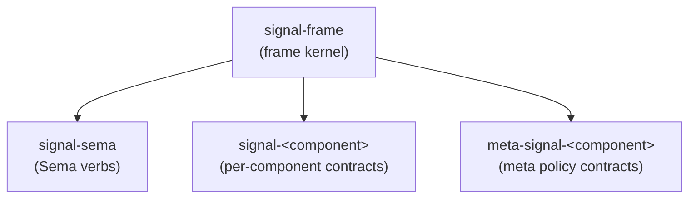
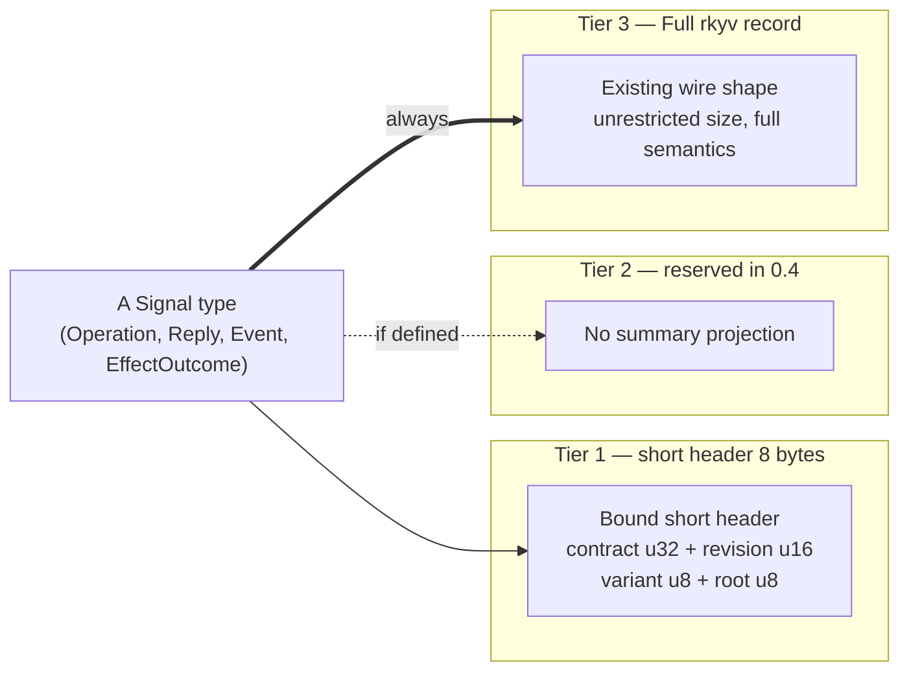
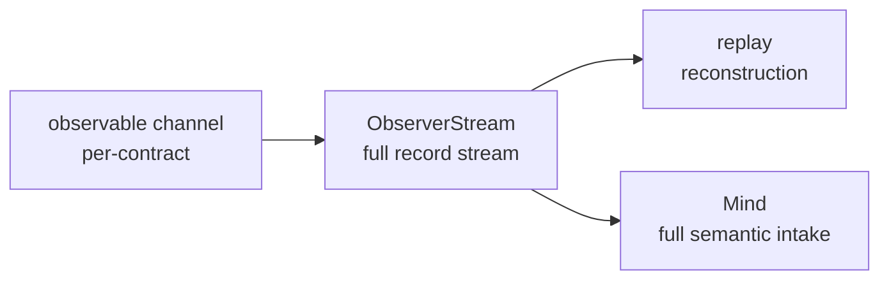

# signal-frame — architecture

*The wire kernel. Frame envelope, length-prefixed rkyv archives,
handshake, exchange identifiers, async correlation, streams, and
reply plumbing — shared by every Rust-to-Rust signaling channel in
the workspace.*

`signal-frame` is the base contract crate for the workspace's typed
inter-component communication. It owns the protocol substrate that
every domain contract uses: frame mechanics, protocol-version
records, exchange identifiers, and the request/reply/event shape.

`signal-frame` is the renamed successor to the former `signal-core`.
The six Sema verbs (`Assert` / `Mutate` / `Retract` / `Match` /
`Subscribe` / `Validate`) that used to live in this crate have moved
to the sibling crate `signal-sema`.

## 0 · TL;DR

`signal-frame` is domain-free and verb-free. Per-component contract
crates depend on it and supply their own contract-local operation
roots in domain-verb form (`Query`, `Submit`, `Configure`,
  `Register`, `Watch`, `Query`, etc.).



Components depend on `signal-frame` for the wire kernel and on
`signal-sema` when they need typed Sema operations internally (for
executor lowering, logging, introspection).

## 0.5 · Direction

The frame kernel is domain-free and verb-free at the universal layer. Per-component contract crates depend on it and supply their own contract-local operation roots in domain-verb form; `signal-frame` adds no domain meaning. `signal_channel!` follows the same boundary: generated frame types are binary by default; DOTOS derives and manual DOTOS impls are gated under the consuming crate's `dotos-text` feature so production daemons depend on `signal-frame` without a DOTOS parser.

The ordinary/meta split is a contract/rebuild boundary, not an engine split. Both `signal-<component>` and `meta-signal-<component>` contracts depend on the same frame kernel; the split is enforced by which crate a caller depends on, not by frame-layer machinery.

Streaming push uses this crate as the low-level wire kernel only: `StreamingFrameBody::SubscriptionEvent` and `SubscriptionTokenInner` are the binary transport shape; `triad-runtime` owns reusable token issuance, registries, and event-frame publication; component daemons supply stream filters and delivery IO.

## 1 · Owns

- Two frame types and their bodies — one per channel shape — plus
  length-prefixed rkyv encoding helpers shared between them:
  - `BoundExchangeFrame<Contract, RequestPayload, ReplyPayload>` /
    `ExchangeFrameBody<RequestPayload, ReplyPayload>` — non-streaming
    channels. Four variants: `HandshakeRequest`, `HandshakeReply`,
    `Request { exchange, request }`, `Reply { exchange, reply }`.
  - `BoundStreamingFrame<Contract, RequestPayload, ReplyPayload, EventPayload>` /
    `StreamingFrameBody<RequestPayload, ReplyPayload, EventPayload>` —
    streaming channels. Adds the fifth variant
    `SubscriptionEvent { event_identifier, token, event }`.
  Splitting keeps non-streaming channels' match patterns clean (no
  uninhabited event arm to discharge) and makes the schema honestly
  reflect which channels emit pushed events.
- `ShortHeader` — the mandatory 64-bit Tier 1 prefix at the front of
  every frame archive. Its low 48 bits bind the archive to a contract
  and wire revision; its high 16 bits carry the contract-local route.
  `BoundExchangeFrame<C, ..>` and `BoundStreamingFrame<C, ..>` derive
  production bindings from `C: WireContract`. Explicitly named
  Raw prefix bytes are represented by `RawShortHeader` and must validate
  into a bound `ShortHeader`; no producer API emits unbound archives.
- The `ShortHeader` prefix that schema-generated route projections
  consume. Richer schema-defined header surfaces are emitted by
  `schema-rust` in component crates; this kernel owns only the
  frame prefix and peek helpers.
- `ProtocolVersion`, `ExchangeMode`, `ExchangeHandshake`, and
  handshake request/reply records.
- `ExchangeIdentifier`, `StreamEventIdentifier`, `ExchangeLane`,
  `LaneSequence`, `SessionEpoch` — frame-layer identity for async
  request/reply correlation and subscription-event placement.
  Both identifier types embed `LaneSequence`. Publisher state owns and
  preserves monotonic sequence allocation; the value type does not prove it.
- `Slot<T>` and `Revision` — frame-bound wire identity records.
- `NonEmpty<T>` — the type-level non-empty sequence used as the
  ordered payload unit inside `Request`.
- `Request<Payload>` carrying `NonEmpty<Payload>` as the ordered
  exchange unit plus optional advisory `Caller` context, with
  feature-gated DOTOS codec (single payload + bracketed sequence). Each
  payload is itself a contract operation; the payload's DOTOS record head
  names the contract-local verb. No per-operation wrapper appears — the
  previous `Operation<Payload>` transparent wrapper has been collapsed
  out. The DOTOS projection intentionally carries only payloads; `Caller`
  is injected by thin CLIs at the frame boundary. The codec exists only
  under `dotos-text`, so daemon default dependency trees keep the binary
  frame kernel without a DOTOS parser.
- `Caller`, `CallerIdentity`, `ProcessIdentifier`, `ExecutablePath`, and
  `ProcessStartTime` — best-effort caller context captured or supplied by
  a component CLI. `CallerIdentity` is the component-facing claimed caller
  label; process facts come from `getppid()` or the current process plus
  Linux `/proc` facts. This is an audit/debug and routing witness, not an
  authority proof.
- `Reply<ReplyPayload>` typed sum: `Accepted { outcome,
  per_operation }` vs `Rejected { reason }`. `AcceptedOutcome`
  distinguishes `Committed` from `OperationAborted { failed_at,
  reason }` and `BatchAborted { reason, retry, commit }`.
  `SubReply<ReplyPayload>` is the per-operation typed sum
  (`Ok` / `Invalidated` / `Failed` / `Skipped`) — positionally
  addressed.
- `BatchErrorClassification` — the frame-level trait that maps a
  daemon-private executor error into wire-safe batch-abort metadata
  (`BatchFailureReason`, `RetryClassification`, `CommitStatus`).
  The typed error itself stays daemon-side.
- `RequestBuilder<Payload>` — the generic multi-operation constructor with
  `RequestBuilderError::EmptyRequest`.
- `RequestPayload` — marker trait carrying the `into_request()`
  convenience that wraps a payload into a length-1 `Request`.
- `SubscriptionTokenInner(u64)` — the wire-side subscription routing
  key; channels wrap it in per-channel typed newtypes.
- The `signal_channel!` macro is re-exported from the sibling
  `signal-frame-macros` proc-macro crate. It declares
  contract-local operation roots directly:
  `operation Submit(Submission)`, not `Assert Submit(Submission)`.
  A channel may opt into a standardized observation surface by
  declaring an `observable` block. Under the three-layer model
  affirmed 2026-05-20 (per `/246-v4`), persona components have a
  *mandatory* observable surface and the macro injects standardized
  `Tap(<FilterType>)` / `Untap(ObserverSubscriptionToken)`
  verbs — no author override for persona components. The macro
  emits the `ObserverStream`, the subscription token type, the
  per-channel `ObserverSet` impl, and (when `filter default;`)
  a closed-enum `ObserverFilter` with matching impl. Non-persona
  utilities may simply omit the `observable` block; if they do
  declare one, the same `Tap`/`Untap` injection applies.
  Macro-emitted names are unprefixed (`Operation`, `Reply`, `Event`,
  `Frame`, `FrameBody`, `Request`, `ReplyEnvelope`,
  `RequestBuilder`, `OperationKind`, `ReplyKind`, `EventKind`);
  crates with multiple channels use Rust modules for disambiguation.
  The macro also emits the structurally obvious `From<Payload> for
  Reply` impls so contract crates do not hand-write conversion
  stacks.
- Under the `dotos-text` feature: `SingleArgument`,
  `SignalOperationHeads`, `CommandLineRouteTable`,
  `CommandLineSockets`, `CommandLineDispatch`, `ClientShape`, and
  `signal_cli!` — the shared thin-CLI frame client. It enforces the
  single-argument rule, parses the argument as DOTOS text or a file path,
  dispatches request heads to ordinary vs meta sockets, injects
  `Caller::from_kernel()`, sends length-prefixed frames, and renders the
  typed reply payload back to DOTOS through `dotos`. Component crates still own their
  domain records, socket deployment paths, daemon behavior, and
  authorization policy.

## 2 · Does Not Own

- The six Sema verbs (`Assert`, `Mutate`, `Retract`, `Match`,
  `Subscribe`, `Validate`). Those live in `signal-sema`.
- `PatternField<T>` and the read-algebra primitives (`Bind`,
  `Wildcard`). Those live in `signal-sema` alongside the verbs they
  pair with.
- Domain records of any kind. Per-component contract crates own
  those.
- redb tables, reducers, or actor supervision.
- Authentication, provenance, or socket-peer policy. Local trust
  belongs to daemon/socket ingress and to dedicated contracts such
  as `signal-persona-origin`.
- Caller authentication. `Caller` is advisory caller context; daemon ingress
  must use socket credentials and policy contracts for actual authority
  decisions.
- Slot allocation, slot dereference, or revision bump behavior.
  Those belong to the Sema engine.
- Nexus text parsing or rendering over DOTOS syntax beyond the codec
  impls already in this crate.

## 3 · Constraints

- `signal-frame` stays domain-free; domain records live in contract
  crates.
- `signal-frame` stays verb-free at the universal layer. The
  contract-local verb appears as the record head of the payload that
  the macro generates per channel; there is no universal verb enum
  in this crate.
- Frame length prefixes are exactly 4-byte big-endian payload
  lengths.
- Decoding rejects short prefixes, mismatched lengths, and bytecheck
  failures.
- Async request/reply matching uses frame-layer `ExchangeIdentifier`
  (session epoch + lane + sequence), negotiated at handshake.
  Payloads never carry transport identifiers.
- Subscription events ride on the acceptor's outbound lane as
  `StreamingFrameBody::SubscriptionEvent` carrying a
  `StreamEventIdentifier` (structurally acceptor-lane-only) and a
  `SubscriptionTokenInner` routing key.
- `signal_channel!` is the standard declaration shape for domain
  channels. The engine is a proc-macro living in the sibling
  `signal-frame-macros` crate; `signal-frame` re-exports it as
  `pub use signal_frame_macros::signal_channel`. Macro-generated
  binary frame types are always emitted; macro-generated DOTOS derives
  and manual DOTOS impls are gated under the consuming crate's
  `dotos-text` feature.
- `Slot<T>` and `Revision` are wire identity records only. The Sema
  engine owns allocation, lookup, compare-and-set, and persistence.
- Text rendering/parsing of DOTOS records belongs to the DOTOS /
  Nexus projection layers. `signal-frame` exposes `dotos` only
  through `dotos-text` for its own thin-CLI and frame-kernel text
  projections; the default binary kernel does not carry a text codec.

## 4 · Invariants

- Multi-payload request shape is structural — the
  `Request<Payload>`'s `NonEmpty<Payload>` sequence preserves
  order and aligns replies positionally. Database atomicity belongs
  to `signal-sema` / `sema-engine` or to a contract that explicitly
  promises it.
- rkyv is the Rust-to-Rust wire. Nexus text in DOTOS syntax is a
  human projection outside this crate.
- Every incoming archive is bytechecked before deserialization.
- `ExchangeFrameBody` / `StreamingFrameBody` carry handshake /
  request / reply (plus subscription-event on the streaming form)
  bodies. Request bodies may carry advisory caller context; they do
  not carry an authority proof.
- Domain payloads remain typed. `signal-frame` does not become a
  generic record bag.
- `Caller` is not part of the human DOTOS request text. CLI-generated
  requests may carry it in the binary frame; decoded DOTOS requests and
  programmatic constructors default it to `None`.
- `Reply` is a typed sum (`Accepted` vs `Rejected`); pre-execution
  rejection cannot carry per-operation results, and accepted replies
  always do. Illegal states unrepresentable.
- Engine failures are accepted batch-abort replies, not frame
  rejections. The wire carries only batch-abort classifications;
  component-private executor errors do not cross the frame boundary.
- Per-operation replies are positionally addressed — the index in
  `per_operation` aligns with the originating request's operation
  index. No universal verb tag.

## 5 · Three-Tier Signal Sizing + Verb Namespace

*Cross-cutting wire-and-observation discipline that every domain
channel inherits through `signal_channel!`. Captured per Spirit
records 244 (three-tier sizing baseline), 251 (Part 1 leans
ratified), 271 (64-bit verb-namespace structure), 272 (universal
data variants pre-allocated across namespaces), 273 (extended
64-byte tier for identity-bearing payloads).*

### 5.1 · Three tiers — what they are and why

Every contract-local Signal type — `Operation`, `Reply`, optional
`Event`, and any explicit contract-owned effect/outcome record — exists
at three projections of progressively richer fidelity:



Three audiences need three fidelities:

- **Tier 1** — log writers, hot indexers, dashboard histograms,
  `persona-introspect` aggregation. 8 bytes per event scales to
  ~134 million events per gigabyte. Tag-only — no payload.
- **Tier 2** — reserved in the current 0.4 contract. There is no
  summary type or summary subscription surface in this crate.
- **Tier 3** — replay, full semantic consumers (Mind, router,
  downstream daemons). The existing rkyv record.

The current 0.4 discipline is **Tier 1 route metadata plus Tier 3
full records**. Tier 1 is generated from `LogVariant`; Tier 2 is not
implemented, and Tier 3 is the existing rkyv record.

### 5.2 · The bound short-header structure (Tier 1 shape)

The short header remains exactly eight little-endian bytes immediately
after the four-byte big-endian length prefix and before the archived
frame body:

| Bits | Type | Meaning |
|---|---|---|
| 0..31 | `ContractId(u32)` | stable numeric contract identity |
| 32..47 | `WireRevision(u16)` | accepted archive-body revision |
| 48..55 | `VariantCode(u8)` | contract-local route variant |
| 56..63 | `RootCode(u8)` | contract-local route root |

`ContractId` and `WireRevision` reserve zero. Parsed prefix bytes remain a
`RawShortHeader` until both identifiers validate; zero never materializes as
a production `ShortHeader`.

The contract and revision are encoded truth, not inferred from socket
placement, payload shape, names, hashes, or probability. `WireContract`
binds constructors at the type level. Allocation constants and registry
enumerations live above this generic kernel.

### 5.3 · Route projection

`LogVariant` continues to project contract-local route information.
Its low byte maps to `RootCode` and its next byte maps to
`VariantCode`; `ShortHeader` places those values in the high sixteen
bits. The remaining header bits are never route vocabulary.

Generated wire ingress is the single `OperationDispatch::dispatch(frame)`
method. It validates the contract binding, classifies the complete root and
variant route, and checks that the request body route equals the archive's
short-header route before handing the operation to the handler. The handler
receives a generated `ValidatedOperation` capability with a private field and
constructor; its `as_operation` / `into_operation` accessors expose trusted
typed handling without allowing downstream code to manufacture the capability
from an arbitrary decoded operation. There is no public `Option` route
classifier or separate decoded-operation dispatch bypass.

### 5.4 · Bound frame surfaces

`BoundExchangeFrame<C, ..>` and `BoundStreamingFrame<C, ..>` are the
production seam. Their constructors accept a route and body, derive
`C::BINDING`, and cover handshake/control, request, reply, and
subscription-event bodies uniformly. Their decoders validate length,
contract, and revision before archive bytecheck or deserialization.

There is no unbound producer envelope, raw header constructor, or legacy
encoder. Migration consumers must move to an allocated `WireContract`
binding before producing frames.

### 5.6 · Tier 2 reservation

The 0.4 wire contract has no Tier 2 summary projection or summary
subscription. Identity-bearing payloads use
the ordinary full rkyv record until a later contract version defines a
separate typed projection.

### 5.7 · Observable stream

The mandatory observable surface (`Tap(<FilterType>)` / `Untap`
injected by the macro) exposes one typed `ObserverStream` of full
records. The current contract does not emit separate Tier 1, Tier 2,
and Tier 3 subscription streams:



The observer set tracks typed subscriptions and publishes the two
contract-declared event records through this one stream.

### 5.8 · Observer-side storage

Observers persist the typed `ObserverStream` records according to
their own retention policy. Storage tiers are outside this crate's
0.4 wire contract:

| Stream | Typed full record | Observer-defined | Observer-defined |
|---|---|---|---|
| ObserverStream | variable rkyv | observer-defined | observer-defined |

The short header can index records by contract, revision, and complete
route before archive decoding.

### 5.9 · What this section owns vs delegates

`signal-frame` owns the primitive binding and route types, exact
short-header packing and validation, the `WireContract` seam,
`LogVariant` and generated operation route checks, and the frame envelopes. The macro
implementation lives in sibling `signal-frame-macros`.

`signal-frame` does NOT own:

- Contract-ID allocation and registry enumeration. Allocation constants
  are supplied by the workspace contract owner, not this generic crate.
- Per-channel root-verb vocabulary — each `signal-<component>`
  crate names its own operation verbs (`Submit`, `Query`,
  `Configure`, etc.).
- Per-channel route interpretation.
- Persisted storage of any tier — observers materialize their own
  storage tiers from the subscription streams.

### 5.10 · Open follow-ons

- The macro implementation for `LogVariant` autogen tracks under
  bead `primary-l02o` (signal-frame: LogVariant trait + autogen
  derive macro).
- Contract-ID allocation constants belong in the workspace registry
  owner and are intentionally absent from this crate.
- Contract crates use the bound wrappers directly in the 0.4 API.

## 6 · Migration history — from signal-core to signal-frame

This crate was extracted from the former `signal-core` on
2026-05-19 as part of the contract-local-verb architecture
redirection. The split:

- `signal-core/src/verb.rs` — the six `SignalVerb` roots — moved
  to `signal-sema`.
- `signal-core/src/pattern.rs` — `Bind` / `Wildcard` /
  `PatternField<T>` — moved to `signal-sema`.
- `Operation::verb` and `RequestPayload::signal_verb()` — removed.
  Each payload is itself a contract operation now; the payload's
  DOTOS record head names the contract-local verb. The transparent
  `Operation<Payload>` wrapper has since been collapsed out too — a
  `Request<Payload>` is now `NonEmpty<Payload>` directly. Per-op
  metadata, if a contract ever needs it, goes in the payload type,
  not in a kernel wrapper.
- `Request::check()` and `Request::into_checked()` (and the
  `CheckedRequest<Payload>` shape) — dropped. With the universal
  verb-shaped rules gone, the function was always `Ok(())` and lied
  about doing work. Channel-specific validation belongs in daemon
  executors or in payload constructors.
- `SubReply::Ok/Invalidated/Failed/Skipped` lost their `verb:
  SignalVerb` discriminator; per-operation replies are positionally
  addressed.
- `RequestRejectionReason::VerbPayloadMismatch` and
  `SubscribeOutOfPosition` were removed. Only the receiver-internal
  pre-execution variant survives — daemons can still surface
  pre-execution failures via `Reply::Rejected { reason:
  RequestRejectionReason::Internal }` or via channel-defined reply
  variants.
- The constant `SIGNAL_CORE_PROTOCOL_VERSION` was renamed
  `SIGNAL_FRAME_PROTOCOL_VERSION`.

The `signal_channel!` macro now accepts contract-local operations
directly through `operation <Verb>(<Payload>)`.

## 7 · Code Map

```text
src/lib.rs            module entry and re-exports
                      (re-exports signal_channel! from signal-frame-macros)
src/error.rs          typed frame errors
src/version.rs        ProtocolVersion + handshake records
src/identity.rs       typed Slot<T> + Revision wire identities
src/caller.rs         advisory parent-process context used by generated
                      thin CLIs
src/request.rs        Request<Payload>, RequestPayload, RequestBuilder<Payload>;
                      Request DOTOS codec (single payload + bracketed sequence)
src/reply.rs          Reply<ReplyPayload> (Accepted / Rejected),
                      AcceptedOutcome, SubReply, OperationFailureReason,
                      BatchErrorClassification
src/exchange.rs       SessionEpoch, ExchangeLane, LaneSequence,
                      ExchangeIdentifier, StreamEventIdentifier,
                      ExchangeMode, ExchangeHandshake
src/subscription.rs   SubscriptionTokenInner
src/non_empty.rs      NonEmpty<T> and NonEmptyError
src/command_line.rs   thin-CLI argument, route table, socket client,
                      reply rendering, and signal_cli! macro
src/frame.rs          BoundExchangeFrame / ExchangeFrameBody,
                      BoundStreamingFrame / StreamingFrameBody,
                      length-prefix helpers
tests/frame.rs        rkyv round-trip + DOTOS round-trip tests
tests/channel_macro.rs
                      dotos-text macro witnesses for non-streaming and
                      streaming channels
tests/channel_macro_binary.rs
                      default-mode witness that signal_channel! emits a
                      binary frame surface without requiring dotos
tests/ui/channel_macro/
                      compile-fail macro witnesses

macros/               sibling proc-macro crate
  Cargo.toml          proc-macro = true
  src/lib.rs          #[proc_macro] signal_channel
  src/parse.rs        syn parser for channel declaration
  src/model.rs        ChannelSpec, StreamBlockSpec, VariantSpecs
  src/validate.rs     semantic checks + span-pointed diagnostics
  src/emit.rs         quote! output
  README.md           macro grammar and validation witnesses
```

## Schema Generation Boundary

`signal-frame` is the wire kernel. It owns `BoundExchangeFrame`,
`BoundStreamingFrame`, `ShortHeader`, `Caller`, request/reply
mechanics, and the streaming subscription envelope. Schema-generated
component contracts consume these kernel types from generated Rust
emitted by `schema-rust`; each generated channel may provide its own
`Frame` alias.

Schema generation does not live in this repo. The retired local
`schema-rust` composer and `emit_schema!` proc-macro path have been
removed. Component crates that are on the schema-derived stack use
`schema-rust` build generation (`schema_rust::build`) to
write source-visible generated modules.

The sibling `macros/` proc-macro crate remains for the current
hand-written `signal_channel!` contract declarations. That macro is a
bridge for contracts that have not yet moved to schema-derived
generation; it does not own daemon runtime, SEMA storage, Nexus
decisions, or the schema compiler.

## See Also

- `/home/li/primary/skills/contract-repo.md` — workspace discipline
  for contract crates that build on this kernel.
- `/home/li/primary/skills/rust-discipline.md` — workspace
  Rust-side conventions this crate follows.
