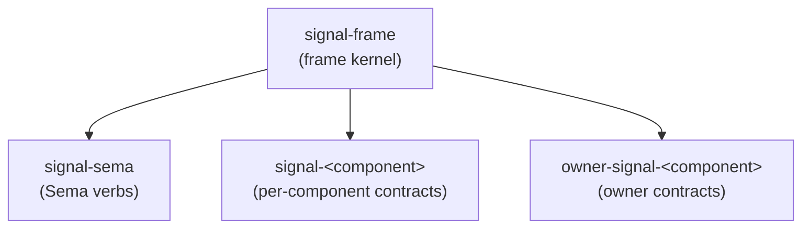

# signal-frame — architecture

*The wire kernel. Frame envelope, length-prefixed rkyv archives,
handshake, exchange identifiers, async correlation, streams, and
reply plumbing — shared by every Rust-to-Rust signaling channel in
the workspace.*

`signal-frame` is the base contract crate for the workspace's typed
inter-component communication. It owns the protocol substrate that
every domain contract uses: frame mechanics, protocol-version
records, exchange identifiers, and the request/reply/event shape.

`signal-frame` is the renamed successor to the former `signal-core`.
The six Sema verbs (`Assert` / `Mutate` / `Retract` / `Match` /
`Subscribe` / `Validate`) that used to live in this crate have moved
to the sibling crate `signal-sema`.

## 0 · TL;DR

`signal-frame` is domain-free and verb-free. Per-component contract
crates depend on it and supply their own contract-local operation
roots in domain-verb form (`Query`, `Submit`, `Configure`,
  `Register`, `Watch`, `Query`, etc.).



Components depend on `signal-frame` for the wire kernel and on
`signal-sema` when they need typed Sema operations internally (for
executor lowering, logging, introspection).

## 1 · Owns

- Two frame types and their bodies — one per channel shape — plus
  length-prefixed rkyv encoding helpers shared between them:
  - `ExchangeFrame<RequestPayload, ReplyPayload>` /
    `ExchangeFrameBody<RequestPayload, ReplyPayload>` — non-streaming
    channels. Four variants: `HandshakeRequest`, `HandshakeReply`,
    `Request { exchange, request }`, `Reply { exchange, reply }`.
  - `StreamingFrame<RequestPayload, ReplyPayload, EventPayload>` /
    `StreamingFrameBody<RequestPayload, ReplyPayload, EventPayload>` —
    streaming channels. Adds the fifth variant
    `SubscriptionEvent { event_identifier, token, event }`.
  Splitting keeps non-streaming channels' match patterns clean (no
  uninhabited event arm to discharge) and makes the schema honestly
  reflect which channels emit pushed events.
- `ProtocolVersion`, `ExchangeMode`, `ExchangeHandshake`, and
  handshake request/reply records.
- `ExchangeIdentifier`, `StreamEventIdentifier`, `ExchangeLane`,
  `LaneSequence`, `SessionEpoch` — frame-layer identity for async
  request/reply correlation and subscription-event placement.
  `LaneSequence` is per-lane monotonic; both identifier types embed
  it.
- `Slot<T>` and `Revision` — frame-bound wire identity records.
- `NonEmpty<T>` — the type-level non-empty sequence used as the
  ordered payload unit inside `Request`.
- `Request<Payload>` carrying `NonEmpty<Payload>` as the ordered
  exchange unit, with NOTA codec (single payload + bracketed
  sequence). Each payload is itself a contract operation; the
  payload's NOTA record head names the contract-local verb. No
  per-operation wrapper appears — the previous `Operation<Payload>`
  transparent wrapper has been collapsed out.
- `Reply<ReplyPayload>` typed sum: `Accepted { outcome,
  per_operation }` vs `Rejected { reason }`. `AcceptedOutcome`
  distinguishes `Committed` from `OperationAborted { failed_at,
  reason }` and `BatchAborted { reason, retry, commit }`.
  `SubReply<ReplyPayload>` is the per-operation typed sum
  (`Ok` / `Invalidated` / `Failed` / `Skipped`) — positionally
  addressed.
- `BatchErrorClassification` — the frame-level trait that maps a
  daemon-private executor error into wire-safe batch-abort metadata
  (`BatchFailureReason`, `RetryClassification`, `CommitStatus`).
  The typed error itself stays daemon-side.
- `RequestBuilder<Payload>` — the generic multi-operation constructor with
  `RequestBuilderError::EmptyRequest`.
- `RequestPayload` — marker trait carrying the `into_request()`
  convenience that wraps a payload into a length-1 `Request`.
- `SubscriptionTokenInner(u64)` — the wire-side subscription routing
  key; channels wrap it in per-channel typed newtypes.
- The `signal_channel!` macro is re-exported from the sibling
  `signal-frame-macros` proc-macro crate. It declares
  contract-local operation roots directly:
  `operation Submit(Submission)`, not `Assert Submit(Submission)`.
  A channel may opt into a standardized observation surface by
  declaring an `observable` block. Under the three-layer model
  affirmed 2026-05-20 (per `/246-v4`), persona components have a
  *mandatory* observable surface and the macro injects standardized
  `Tap(<FilterType>)` / `Untap(<Channel>ObserverSubscriptionToken)`
  verbs — no author override for persona components. The macro
  emits the `<Channel>ObserverStream`, the subscription token type,
  the per-channel `ObserverSet` impl, and (when `filter default;`)
  a closed-enum `ObserverFilter` with matching impl. Non-persona
  utilities may simply omit the `observable` block; if they do
  declare one, the same `Tap`/`Untap` injection applies.

## 2 · Does Not Own

- The six Sema verbs (`Assert`, `Mutate`, `Retract`, `Match`,
  `Subscribe`, `Validate`). Those live in `signal-sema`.
- `PatternField<T>` and the read-algebra primitives (`Bind`,
  `Wildcard`). Those live in `signal-sema` alongside the verbs they
  pair with.
- Domain records of any kind. Per-component contract crates own
  those.
- redb tables, reducers, or actor supervision.
- Authentication, provenance, or socket-peer policy. Local trust
  belongs to daemon/socket ingress and to dedicated contracts such
  as `signal-persona-auth`.
- Slot allocation, slot dereference, or revision bump behavior.
  Those belong to the Sema engine.
- Nexus text parsing or rendering over NOTA syntax beyond the codec
  impls already in this crate.

## 3 · Constraints

- `signal-frame` stays domain-free; domain records live in contract
  crates.
- `signal-frame` stays verb-free at the universal layer. The
  contract-local verb appears as the record head of the payload that
  the macro generates per channel; there is no universal verb enum
  in this crate.
- Frame length prefixes are exactly 4-byte big-endian payload
  lengths.
- Decoding rejects short prefixes, mismatched lengths, and bytecheck
  failures.
- Async request/reply matching uses frame-layer `ExchangeIdentifier`
  (session epoch + lane + sequence), negotiated at handshake.
  Payloads never carry transport identifiers.
- Subscription events ride on the acceptor's outbound lane as
  `StreamingFrameBody::SubscriptionEvent` carrying a
  `StreamEventIdentifier` (same wire shape as `ExchangeIdentifier`,
  distinct type) and a `SubscriptionTokenInner` routing key.
- `signal_channel!` is the standard declaration shape for domain
  channels. The engine is a proc-macro living in the sibling
  `signal-frame-macros` crate; `signal-frame` re-exports it as
  `pub use signal_frame_macros::signal_channel`.
- `Slot<T>` and `Revision` are wire identity records only. The Sema
  engine owns allocation, lookup, compare-and-set, and persistence.
- Text rendering/parsing of NOTA records belongs to NOTA / Nexus
  projection layers — `signal-frame` only carries the codec impls
  needed to round-trip its own records.

## 4 · Invariants

- Multi-payload request shape is structural — the
  `Request<Payload>`'s `NonEmpty<Payload>` sequence preserves
  order and aligns replies positionally. Database atomicity belongs
  to `signal-sema` / `sema-engine` or to a contract that explicitly
  promises it.
- rkyv is the Rust-to-Rust wire. Nexus text in NOTA syntax is a
  human projection outside this crate.
- Every incoming archive is bytechecked before deserialization.
- `ExchangeFrameBody` / `StreamingFrameBody` carry handshake /
  request / reply (plus subscription-event on the streaming form)
  bodies. No in-band authentication or provenance material.
- Domain payloads remain typed. `signal-frame` does not become a
  generic record bag.
- `Reply` is a typed sum (`Accepted` vs `Rejected`); pre-execution
  rejection cannot carry per-operation results, and accepted replies
  always do. Illegal states unrepresentable.
- Engine failures are accepted batch-abort replies, not frame
  rejections. The wire carries only batch-abort classifications;
  component-private executor errors do not cross the frame boundary.
- Per-operation replies are positionally addressed — the index in
  `per_operation` aligns with the originating request's operation
  index. No universal verb tag.

## 5 · Migration history — from signal-core to signal-frame

This crate was extracted from the former `signal-core` on
2026-05-19 as part of the contract-local-verb architecture
redirection. The split:

- `signal-core/src/verb.rs` — the six `SignalVerb` roots — moved
  to `signal-sema`.
- `signal-core/src/pattern.rs` — `Bind` / `Wildcard` /
  `PatternField<T>` — moved to `signal-sema`.
- `Operation::verb` and `RequestPayload::signal_verb()` — removed.
  Each payload is itself a contract operation now; the payload's
  NOTA record head names the contract-local verb. The transparent
  `Operation<Payload>` wrapper has since been collapsed out too — a
  `Request<Payload>` is now `NonEmpty<Payload>` directly. Per-op
  metadata, if a contract ever needs it, goes in the payload type,
  not in a kernel wrapper.
- `Request::check()` and `Request::into_checked()` (and the
  `CheckedRequest<Payload>` shape) — dropped. With the universal
  verb-shaped rules gone, the function was always `Ok(())` and lied
  about doing work. Channel-specific validation belongs in daemon
  executors or in payload constructors.
- `SubReply::Ok/Invalidated/Failed/Skipped` lost their `verb:
  SignalVerb` discriminator; per-operation replies are positionally
  addressed.
- `RequestRejectionReason::VerbPayloadMismatch` and
  `SubscribeOutOfPosition` were removed. Only the receiver-internal
  pre-execution variant survives — daemons can still surface
  pre-execution failures via `Reply::Rejected { reason:
  RequestRejectionReason::Internal }` or via channel-defined reply
  variants.
- The constant `SIGNAL_CORE_PROTOCOL_VERSION` was renamed
  `SIGNAL_FRAME_PROTOCOL_VERSION`.

The `signal_channel!` macro now accepts contract-local operations
directly through `operation <Verb>(<Payload>)`.

## 6 · Code Map

```text
src/lib.rs            module entry and re-exports
                      (re-exports signal_channel! from signal-frame-macros)
src/error.rs          typed frame errors
src/version.rs        ProtocolVersion + handshake records
src/identity.rs       typed Slot<T> + Revision wire identities
src/request.rs        Request<Payload>, RequestPayload, RequestBuilder<Payload>;
                      Request NOTA codec (single payload + bracketed sequence)
src/reply.rs          Reply<ReplyPayload> (Accepted / Rejected),
                      AcceptedOutcome, SubReply, OperationFailureReason,
                      BatchErrorClassification
src/exchange.rs       SessionEpoch, ExchangeLane, LaneSequence,
                      ExchangeIdentifier, StreamEventIdentifier,
                      ExchangeMode, ExchangeHandshake
src/subscription.rs   SubscriptionTokenInner
src/non_empty.rs      NonEmpty<T> and NonEmptyError
src/frame.rs          ExchangeFrame / ExchangeFrameBody,
                      StreamingFrame / StreamingFrameBody,
                      length-prefix helpers
tests/frame.rs        rkyv round-trip + NOTA round-trip tests
tests/channel_macro.rs
                      positive macro witnesses for non-streaming and
                      streaming channels
tests/ui/channel_macro/
                      compile-fail macro witnesses

macros/               sibling proc-macro crate
  Cargo.toml          proc-macro = true
  src/lib.rs          #[proc_macro] signal_channel
  src/parse.rs        syn parser for channel declaration
  src/model.rs        ChannelSpec, StreamBlockSpec, VariantSpecs
  src/validate.rs     semantic checks + span-pointed diagnostics
  src/emit.rs         quote! output
  README.md           macro grammar and validation witnesses
```

## See Also

- `/home/li/primary/skills/contract-repo.md` — workspace discipline
  for contract crates that build on this kernel.
- `/home/li/primary/skills/rust-discipline.md` — workspace
  Rust-side conventions this crate follows.
