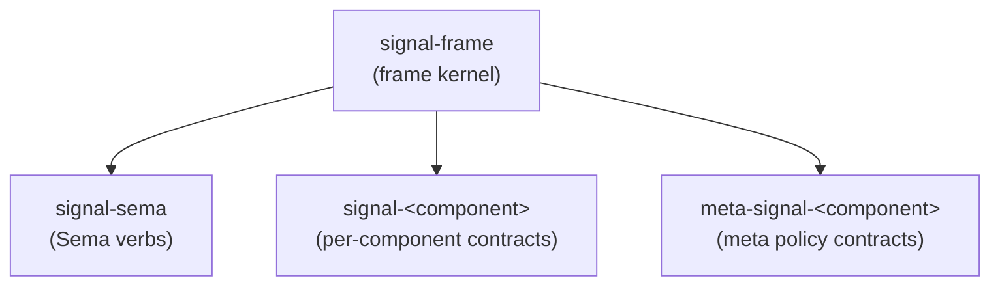
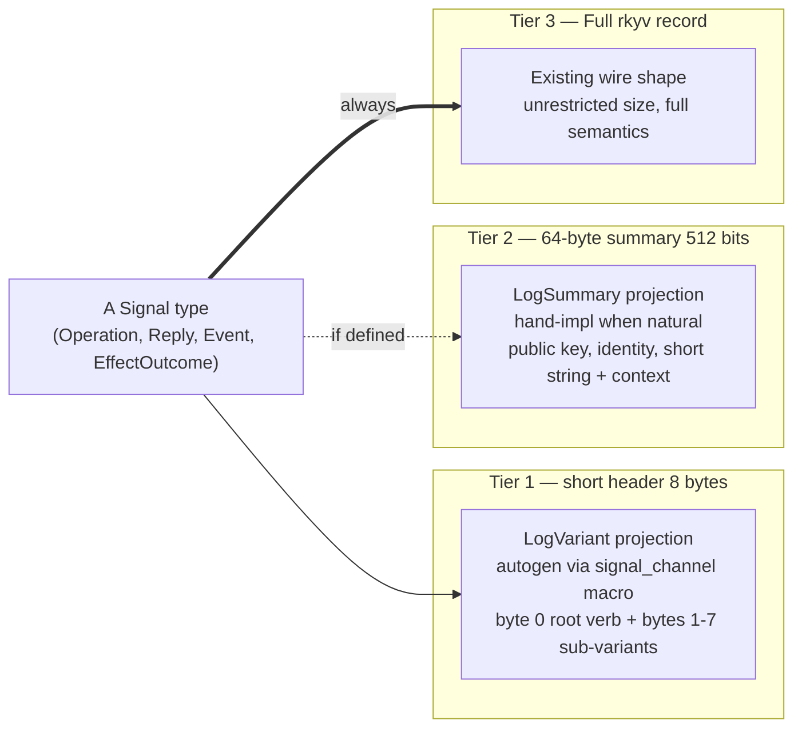
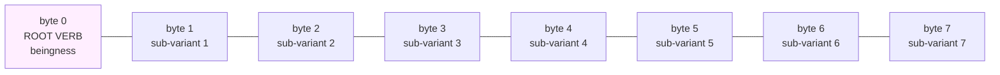
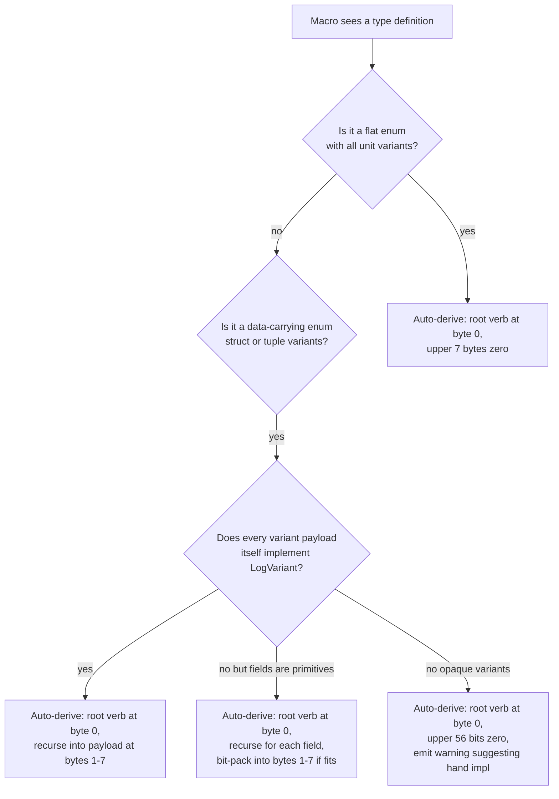
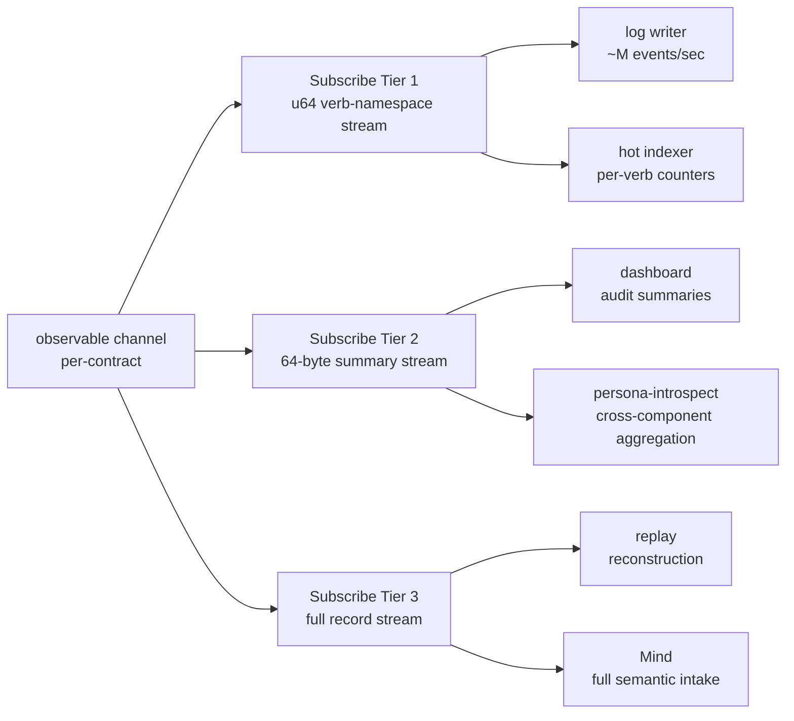

# signal-frame — architecture

*The wire kernel. Frame envelope, length-prefixed rkyv archives,
handshake, exchange identifiers, async correlation, streams, and
reply plumbing — shared by every Rust-to-Rust signaling channel in
the workspace.*

`signal-frame` is the base contract crate for the workspace's typed
inter-component communication. It owns the protocol substrate that
every domain contract uses: frame mechanics, protocol-version
records, exchange identifiers, and the request/reply/event shape.

`signal-frame` is the renamed successor to the former `signal-core`.
The six Sema verbs (`Assert` / `Mutate` / `Retract` / `Match` /
`Subscribe` / `Validate`) that used to live in this crate have moved
to the sibling crate `signal-sema`.

## 0 · TL;DR

`signal-frame` is domain-free and verb-free. Per-component contract
crates depend on it and supply their own contract-local operation
roots in domain-verb form (`Query`, `Submit`, `Configure`,
  `Register`, `Watch`, `Query`, etc.).



Components depend on `signal-frame` for the wire kernel and on
`signal-sema` when they need typed Sema operations internally (for
executor lowering, logging, introspection).

## 1 · Owns

- Two frame types and their bodies — one per channel shape — plus
  length-prefixed rkyv encoding helpers shared between them:
  - `ExchangeFrame<RequestPayload, ReplyPayload>` /
    `ExchangeFrameBody<RequestPayload, ReplyPayload>` — non-streaming
    channels. Four variants: `HandshakeRequest`, `HandshakeReply`,
    `Request { exchange, request }`, `Reply { exchange, reply }`.
  - `StreamingFrame<RequestPayload, ReplyPayload, EventPayload>` /
    `StreamingFrameBody<RequestPayload, ReplyPayload, EventPayload>` —
    streaming channels. Adds the fifth variant
    `SubscriptionEvent { event_identifier, token, event }`.
  Splitting keeps non-streaming channels' match patterns clean (no
  uninhabited event arm to discharge) and makes the schema honestly
  reflect which channels emit pushed events.
- `ShortHeader` — the mandatory 64-bit Tier 1 prefix at the front of
  every frame archive. `Frame::new(body)` creates an empty short
  header for compatibility; projection-aware constructors use
  `Frame::with_short_header(short_header, body)`.
- The `ShortHeader` prefix that schema-generated route projections
  consume. Richer schema-defined header surfaces are emitted by
  `schema-rust-next` in component crates; this kernel owns only the
  frame prefix and peek helpers.
- `ProtocolVersion`, `ExchangeMode`, `ExchangeHandshake`, and
  handshake request/reply records.
- `ExchangeIdentifier`, `StreamEventIdentifier`, `ExchangeLane`,
  `LaneSequence`, `SessionEpoch` — frame-layer identity for async
  request/reply correlation and subscription-event placement.
  `LaneSequence` is per-lane monotonic; both identifier types embed
  it.
- `Slot<T>` and `Revision` — frame-bound wire identity records.
- `NonEmpty<T>` — the type-level non-empty sequence used as the
  ordered payload unit inside `Request`.
- `Request<Payload>` carrying `NonEmpty<Payload>` as the ordered
  exchange unit plus optional advisory `Caller` process context, with
  feature-gated NOTA codec (single payload + bracketed sequence). Each
  payload is itself a contract operation; the payload's NOTA record head
  names the contract-local verb. No per-operation wrapper appears — the
  previous `Operation<Payload>` transparent wrapper has been collapsed
  out. The NOTA projection intentionally carries only payloads; `Caller`
  is injected by thin CLIs at the frame boundary. The codec exists only
  under `nota-text`, so daemon default dependency trees keep the binary
  frame kernel without a NOTA parser.
- `Caller`, `ProcessIdentifier`, `ExecutablePath`, and
  `ProcessStartTime` — best-effort parent-process context captured by
  a component CLI with `getppid()` plus Linux `/proc` facts. This is an
  audit/debug witness, not an authority proof.
- `Reply<ReplyPayload>` typed sum: `Accepted { outcome,
  per_operation }` vs `Rejected { reason }`. `AcceptedOutcome`
  distinguishes `Committed` from `OperationAborted { failed_at,
  reason }` and `BatchAborted { reason, retry, commit }`.
  `SubReply<ReplyPayload>` is the per-operation typed sum
  (`Ok` / `Invalidated` / `Failed` / `Skipped`) — positionally
  addressed.
- `BatchErrorClassification` — the frame-level trait that maps a
  daemon-private executor error into wire-safe batch-abort metadata
  (`BatchFailureReason`, `RetryClassification`, `CommitStatus`).
  The typed error itself stays daemon-side.
- `RequestBuilder<Payload>` — the generic multi-operation constructor with
  `RequestBuilderError::EmptyRequest`.
- `RequestPayload` — marker trait carrying the `into_request()`
  convenience that wraps a payload into a length-1 `Request`.
- `SubscriptionTokenInner(u64)` — the wire-side subscription routing
  key; channels wrap it in per-channel typed newtypes.
- The `signal_channel!` macro is re-exported from the sibling
  `signal-frame-macros` proc-macro crate. It declares
  contract-local operation roots directly:
  `operation Submit(Submission)`, not `Assert Submit(Submission)`.
  A channel may opt into a standardized observation surface by
  declaring an `observable` block. Under the three-layer model
  affirmed 2026-05-20 (per `/246-v4`), persona components have a
  *mandatory* observable surface and the macro injects standardized
  `Tap(<FilterType>)` / `Untap(ObserverSubscriptionToken)`
  verbs — no author override for persona components. The macro
  emits the `ObserverStream`, the subscription token type, the
  per-channel `ObserverSet` impl, and (when `filter default;`)
  a closed-enum `ObserverFilter` with matching impl. Non-persona
  utilities may simply omit the `observable` block; if they do
  declare one, the same `Tap`/`Untap` injection applies.
  Macro-emitted names are unprefixed (`Operation`, `Reply`, `Event`,
  `Frame`, `FrameBody`, `Request`, `ReplyEnvelope`,
  `RequestBuilder`, `OperationKind`, `ReplyKind`, `EventKind`);
  crates with multiple channels use Rust modules for disambiguation.
  The macro also emits the structurally obvious `From<Payload> for
  Reply` impls so contract crates do not hand-write conversion
  stacks.
- Under the `nota-text` feature: `SingleArgument`,
  `SignalOperationHeads`, `CommandLineRouteTable`,
  `CommandLineSockets`, `CommandLineDispatch`, `ClientShape`, and
  `signal_cli!` — the shared thin-CLI frame client. It enforces the
  single-argument rule, parses the argument as NOTA text or a file path,
  dispatches request heads to ordinary vs meta sockets, injects
  `Caller::from_kernel()`, sends length-prefixed frames, and renders the
  typed reply payload back to NOTA through `nota-next`. Component crates still own their
  domain records, socket deployment paths, daemon behavior, and
  authorization policy.

## 2 · Does Not Own

- The six Sema verbs (`Assert`, `Mutate`, `Retract`, `Match`,
  `Subscribe`, `Validate`). Those live in `signal-sema`.
- `PatternField<T>` and the read-algebra primitives (`Bind`,
  `Wildcard`). Those live in `signal-sema` alongside the verbs they
  pair with.
- Domain records of any kind. Per-component contract crates own
  those.
- redb tables, reducers, or actor supervision.
- Authentication, provenance, or socket-peer policy. Local trust
  belongs to daemon/socket ingress and to dedicated contracts such
  as `signal-persona-origin`.
- Caller authentication. `Caller` is advisory process context; daemon
  ingress must use socket credentials and policy contracts for actual
  authority decisions.
- Slot allocation, slot dereference, or revision bump behavior.
  Those belong to the Sema engine.
- Nexus text parsing or rendering over NOTA syntax beyond the codec
  impls already in this crate.

## 3 · Constraints

- `signal-frame` stays domain-free; domain records live in contract
  crates.
- `signal-frame` stays verb-free at the universal layer. The
  contract-local verb appears as the record head of the payload that
  the macro generates per channel; there is no universal verb enum
  in this crate.
- Frame length prefixes are exactly 4-byte big-endian payload
  lengths.
- Decoding rejects short prefixes, mismatched lengths, and bytecheck
  failures.
- Async request/reply matching uses frame-layer `ExchangeIdentifier`
  (session epoch + lane + sequence), negotiated at handshake.
  Payloads never carry transport identifiers.
- Subscription events ride on the acceptor's outbound lane as
  `StreamingFrameBody::SubscriptionEvent` carrying a
  `StreamEventIdentifier` (same wire shape as `ExchangeIdentifier`,
  distinct type) and a `SubscriptionTokenInner` routing key.
- `signal_channel!` is the standard declaration shape for domain
  channels. The engine is a proc-macro living in the sibling
  `signal-frame-macros` crate; `signal-frame` re-exports it as
  `pub use signal_frame_macros::signal_channel`. Macro-generated
  binary frame types are always emitted; macro-generated NOTA derives
  and manual NOTA impls are gated under the consuming crate's
  `nota-text` feature.
- `Slot<T>` and `Revision` are wire identity records only. The Sema
  engine owns allocation, lookup, compare-and-set, and persistence.
- Text rendering/parsing of NOTA records belongs to the NOTA /
  Nexus projection layers. `signal-frame` exposes `nota-next` only
  through `nota-text` for its own thin-CLI and frame-kernel text
  projections; the default binary kernel does not carry a text codec.

## 4 · Invariants

- Multi-payload request shape is structural — the
  `Request<Payload>`'s `NonEmpty<Payload>` sequence preserves
  order and aligns replies positionally. Database atomicity belongs
  to `signal-sema` / `sema-engine` or to a contract that explicitly
  promises it.
- rkyv is the Rust-to-Rust wire. Nexus text in NOTA syntax is a
  human projection outside this crate.
- Every incoming archive is bytechecked before deserialization.
- `ExchangeFrameBody` / `StreamingFrameBody` carry handshake /
  request / reply (plus subscription-event on the streaming form)
  bodies. No in-band authentication or provenance material.
- Domain payloads remain typed. `signal-frame` does not become a
  generic record bag.
- `Caller` is not part of the human NOTA request text. CLI-generated
  requests may carry it in the binary frame; decoded NOTA requests and
  programmatic constructors default it to `None`.
- `Reply` is a typed sum (`Accepted` vs `Rejected`); pre-execution
  rejection cannot carry per-operation results, and accepted replies
  always do. Illegal states unrepresentable.
- Engine failures are accepted batch-abort replies, not frame
  rejections. The wire carries only batch-abort classifications;
  component-private executor errors do not cross the frame boundary.
- Per-operation replies are positionally addressed — the index in
  `per_operation` aligns with the originating request's operation
  index. No universal verb tag.

## 5 · Three-Tier Signal Sizing + Verb Namespace

*Cross-cutting wire-and-observation discipline that every domain
channel inherits through `signal_channel!`. Captured per Spirit
records 244 (three-tier sizing baseline), 251 (Part 1 leans
ratified), 271 (64-bit verb-namespace structure), 272 (universal
data variants pre-allocated across namespaces), 273 (extended
64-byte tier for identity-bearing payloads).*

### 5.1 · Three tiers — what they are and why

Every contract-local Signal type — `Operation`, `Reply`, optional
`Event`, and any explicit contract-owned effect/outcome record — exists
at three projections of progressively richer fidelity:



Three audiences need three fidelities:

- **Tier 1** — log writers, hot indexers, dashboard histograms,
  `persona-introspect` aggregation. 8 bytes per event scales to
  ~134 million events per gigabyte. Tag-only — no payload.
- **Tier 2** — auditors, slow dashboards, observers that need to
  follow the story without the full payload. 64 bytes fits one
  Ed25519 public key (32 bytes) plus 32 bytes of typed context, or
  one BLS12-381 G1 compressed point (48 bytes) plus identity tags.
- **Tier 3** — replay, full semantic consumers (Mind, router,
  downstream daemons). The existing rkyv record.

The discipline: **Tier 1 is mandatory and autogen; Tier 2 is opt-in
hand-impl when a semantic summary exists; Tier 3 is the existing
record.** Producers emit each tier on demand based on per-tier
subscriber count.

### 5.2 · The short-header verb-namespace structure (Tier 1 shape)

Tier 1 is not a free-form 64-bit field — it carries a standardized
verb namespace. **One byte 0 root verb plus seven bytes 1-7
sub-variants, eight enums total, packed into a `u64`.** The root
verb is the "beingness" of the signal type — its most universal
quality. Sub-variants are data-carrying classifications attached to
the verb namespace.

Per Spirit records 388-392, the canonical name of this 64-bit prefix
is **short header**. The MVP shape is deliberately simple: one root
enum plus seven sub-enums, one full byte each. Both `ExchangeFrame`
and `StreamingFrame` encode the short header immediately after the
length prefix and before the archived frame body, so length-prefixed
socket readers can inspect bytes `4..12` without deserializing the
full frame body. The length prefix remains big-endian `u32`; the
short header uses little-endian `u64` bytes to match the workspace
rkyv pin.



**Why verbs at the root.** Verbs are the most universal quality of
a signal type — putting them at byte 0 (LSB) lets the daemon
classify and dispatch on the root operation kind cheaply via a
single byte read. Within a single channel, byte-0 histograms give
the channel's root-verb distribution in a linear scan.

**The byte-0 namespace is per-component, not workspace-wide.** Each
contract crate (each channel) declares its OWN root verb enum local
to that channel. Same byte value on different channels means
different verbs — the decoder reads byte 0 IN THE CONTEXT of which
channel the byte stream came from (provenance). The consumer always
knows its subscription channel; provenance is implicit at the
subscription boundary. Per spirit record 326 (correction superseding
the shared-workspace-enum framing this section originally carried)
and detailed in `reports/designer/305-v2-design-64bit-signal-per-component-namespacing.md`.

**Byte-0 split between meta and ordinary contracts** (per spirit
record 327, under detailed design): for a component triad, the
ordinary `signal-<comp>` contract and the meta `meta-signal-<comp>`
contract each claim a SECTION of the 256-variant byte-0 space,
divided at the golden ratio (~0.39 / 0.61). The macro enforces
compile-time agreement between the two contracts (both must agree
on which side is the small section and which is the big — if both
claim the same side, compilation fails). Default: meta contract
takes the small section, ordinary contract takes the big. The split
opens the potential for single-socket-per-component dispatch where
the byte-0 section IS the meta-vs-ordinary discriminator (Medium
certainty exploration). Detailed mechanism lands in
`reports/designer/307-design-golden-ratio-namespace-split.md` once
that design completes.

**Cross-channel verb aggregation** is semantic, not byte-level.
"How many Record-shaped operations across the workspace today?"
requires the rollup-er to know which channel's byte-X means "Record"
on that channel — the same byte value on another channel may mean
something entirely different. The per-component namespacing
prevents cross-channel byte conflation and makes per-channel
indexing maximally efficient — both desired outcomes.

**Eight enums per type:** one root verb enum + seven sub-variant
enums, all local to the channel. The sub-variant enums are
namespace-specific (each component contract declares its own
seven), and bytes 1-7 always carry sub-variant classifications,
never raw payload data. Universal data variants (per §5.3) are
inherited by every channel's slot enums.

### 5.3 · Universal data variants — shared sub-variant vocabulary

Per Spirit record 272, **every namespace pre-allocates a base set
of universal data sub-variants**, so all namespaces share a common
primitive vocabulary in bytes 1-7. The current universal set:

| Variant | Width | Use |
|---|---|---|
| `U8` | 1 byte | generic small counter, sub-tag, qualitative magnitude |
| `U16` | 2 bytes | short identifiers (e.g. Criome 16-bit short ID derived from a public key, with polite-rename-on-collision convention) |

The universal set grows over time as new primitive types prove
useful across multiple namespaces; the macro grammar reserves an
inheritance hook so adding a new universal does not force every
channel to re-emit. The point is that an observer reading a
cross-component Tier 1 stream sees `U16` carrying the same semantics
in `signal-spirit`, `signal-criome`, `signal-mind`, etc.

### 5.4 · Macro autogen — the decision tree

`signal_channel!` autogen for `LogVariant` walks the type per the
decision tree below (originally /155 §1.5, refined for the
verb-namespace structure):



The root verb discriminator is **always** at byte 0 — invariant of
the macro. Hand-impl only the projection (e.g. "the first 8 bytes
of a BLS signature"); never break the byte-0 root-verb rule.

### 5.5 · How `signal_channel!` plays — variant always at root

Because `signal_channel!`-generated `Operation`, `Reply`, `Effect`,
and (when observable) the observer event types are all enums at
the top level, the root-verb invariant is satisfied by macro
construction. The per-channel `Operation` enum's variant
discriminator IS the byte-0 root verb for that channel's Tier 1
stream. Sub-variants in bytes 1-7 are channel-defined.

Internal data records (the structs declared in `signal-<component>`
crates that ride inside payloads) do not need to reshape into
top-level enums to participate in Tier 1. They emit a constant
discriminator (one possible "root verb" for that record family) plus
packed fields, per the §5.4 decision tree's bottom branches.

### 5.6 · Tier 2 — extended 64-byte / 512-bit identity-bearing tier

Per Spirit record 273, Tier 2 carries payloads needing **public
keys, identities, or larger structured data**. The canonical use
case: a Criome authorization payload carrying quorum public keys
plus a signature. The tier sits between Tier 1 (root verb plus
packed sub-variants) and Tier 3 (full unrestricted rkyv), and
**lets authoritative identity ride with a log entry without
dropping into Tier 3.**

64-byte budget supports:

| Shape | Fit |
|---|---|
| Ed25519 public key (32) + typed context (32) | exact |
| BLS12-381 G1 compressed point (48) + metadata (16) | exact |
| SHA-256 / Blake3 hash (32) + other context (32) | exact |
| Short string up to ~60 bytes + length prefix | exact |
| Eight `u64`s | exact |
| Two `ContractVersion` (32 each) | exact |
| `ComponentName` + `Version` + a couple of enum tags | natural for meta-signal-version-handover summaries |

The `LogSummary` trait carries a const-generic compile-time size
check (`size_of::<Self::Summary>() <= 64`). Over-budget summaries
fail to compile, not at runtime.

### 5.7 · Three subscription tiers — `observable` block extension

The mandatory observable surface (`Tap(<FilterType>)` / `Untap`
injected by the macro per the three-layer model affirmed
2026-05-20) extends to expose **three subscription tiers** rather
than one full-record stream:



Producer cost: one projection per active tier. Most channels will
in practice have Tier 1 + Tier 3 subscribers; Tier 2 is opt-in
where it adds enough fidelity to justify a hand-implemented
summary. The runtime tracks per-tier subscriber count and emits
each tier on demand — subscribers that pay only for Tier 1 do not
force the producer to project Tier 2.

### 5.8 · Storage efficiency at observer side

Persona-introspect (or any observer with persistence) materializes
three storage tiers from the three subscription tiers, with roughly
8x cost ratio between adjacent tiers:

| Tier | Size | Per GB | Retention |
|---|---|---|---|
| Tier 1 hot | 8 bytes | ~134M events | indefinite (cheap) |
| Tier 2 warm | 64 bytes | ~16M summaries | 30-90 days |
| Tier 3 cold | variable rkyv | ~5M records (typical) | per-record TTL |

Tier 1 fits comfortably in a single SSD write stream at 1M
events/sec; Tier 3 needs batching + compression to keep up at
sustained rates. The verb-namespace structure makes Tier 1 indexes
particularly efficient — group-by-byte-0 gives the root-verb
histogram in a single linear scan.

### 5.9 · What this section owns vs delegates

`signal-frame` owns the `LogVariant` and `LogSummary` traits, the
`signal_channel!` macro autogen logic for Tier 1, the universal
data sub-variant set, and the three-subscription-tier shape in the
mandatory observable block. The macro implementation lives in
sibling `signal-frame-macros`.

`signal-frame` does NOT own:

- Per-channel root-verb vocabulary — each `signal-<component>`
  crate names its own operation verbs (`Submit`, `Query`,
  `Configure`, etc.); the workspace-shared root-verb registry is
  a separate concern (see §5.10 below).
- Per-channel sub-variant enums beyond the universal set —
  contract crates declare seven sub-variant enums per channel as
  needed.
- Persisted storage of any tier — observers materialize their own
  storage tiers from the subscription streams.

### 5.10 · Open follow-ons

- The macro implementation for `LogVariant` autogen tracks under
  bead `primary-l02o` (signal-frame: LogVariant trait + autogen
  derive macro).
- The specific universal-data-variant set beyond `U8` / `U16` is
  not yet decided; new primitives land as concrete cross-component
  needs surface (Spirit record 272 leaves room for "possibly more
  primitive types").
- A workspace-wide root-verb registry mechanism is not yet
  specified — currently each channel's root verbs are namespace-
  local enum variants. A future cross-namespace vocabulary catalog
  (so `Tap` always means `Tap` regardless of channel) is a follow-on
  worth a dedicated bead.

## 6 · Migration history — from signal-core to signal-frame

This crate was extracted from the former `signal-core` on
2026-05-19 as part of the contract-local-verb architecture
redirection. The split:

- `signal-core/src/verb.rs` — the six `SignalVerb` roots — moved
  to `signal-sema`.
- `signal-core/src/pattern.rs` — `Bind` / `Wildcard` /
  `PatternField<T>` — moved to `signal-sema`.
- `Operation::verb` and `RequestPayload::signal_verb()` — removed.
  Each payload is itself a contract operation now; the payload's
  NOTA record head names the contract-local verb. The transparent
  `Operation<Payload>` wrapper has since been collapsed out too — a
  `Request<Payload>` is now `NonEmpty<Payload>` directly. Per-op
  metadata, if a contract ever needs it, goes in the payload type,
  not in a kernel wrapper.
- `Request::check()` and `Request::into_checked()` (and the
  `CheckedRequest<Payload>` shape) — dropped. With the universal
  verb-shaped rules gone, the function was always `Ok(())` and lied
  about doing work. Channel-specific validation belongs in daemon
  executors or in payload constructors.
- `SubReply::Ok/Invalidated/Failed/Skipped` lost their `verb:
  SignalVerb` discriminator; per-operation replies are positionally
  addressed.
- `RequestRejectionReason::VerbPayloadMismatch` and
  `SubscribeOutOfPosition` were removed. Only the receiver-internal
  pre-execution variant survives — daemons can still surface
  pre-execution failures via `Reply::Rejected { reason:
  RequestRejectionReason::Internal }` or via channel-defined reply
  variants.
- The constant `SIGNAL_CORE_PROTOCOL_VERSION` was renamed
  `SIGNAL_FRAME_PROTOCOL_VERSION`.

The `signal_channel!` macro now accepts contract-local operations
directly through `operation <Verb>(<Payload>)`.

## 7 · Code Map

```text
src/lib.rs            module entry and re-exports
                      (re-exports signal_channel! from signal-frame-macros)
src/error.rs          typed frame errors
src/version.rs        ProtocolVersion + handshake records
src/identity.rs       typed Slot<T> + Revision wire identities
src/caller.rs         advisory parent-process context used by generated
                      thin CLIs
src/request.rs        Request<Payload>, RequestPayload, RequestBuilder<Payload>;
                      Request NOTA codec (single payload + bracketed sequence)
src/reply.rs          Reply<ReplyPayload> (Accepted / Rejected),
                      AcceptedOutcome, SubReply, OperationFailureReason,
                      BatchErrorClassification
src/exchange.rs       SessionEpoch, ExchangeLane, LaneSequence,
                      ExchangeIdentifier, StreamEventIdentifier,
                      ExchangeMode, ExchangeHandshake
src/subscription.rs   SubscriptionTokenInner
src/non_empty.rs      NonEmpty<T> and NonEmptyError
src/command_line.rs   thin-CLI argument, route table, socket client,
                      reply rendering, and signal_cli! macro
src/frame.rs          ExchangeFrame / ExchangeFrameBody,
                      StreamingFrame / StreamingFrameBody,
                      length-prefix helpers
tests/frame.rs        rkyv round-trip + NOTA round-trip tests
tests/channel_macro.rs
                      nota-text macro witnesses for non-streaming and
                      streaming channels
tests/channel_macro_binary.rs
                      default-mode witness that signal_channel! emits a
                      binary frame surface without requiring nota-next
tests/ui/channel_macro/
                      compile-fail macro witnesses

macros/               sibling proc-macro crate
  Cargo.toml          proc-macro = true
  src/lib.rs          #[proc_macro] signal_channel
  src/parse.rs        syn parser for channel declaration
  src/model.rs        ChannelSpec, StreamBlockSpec, VariantSpecs
  src/validate.rs     semantic checks + span-pointed diagnostics
  src/emit.rs         quote! output
  README.md           macro grammar and validation witnesses
```

## Schema Generation Boundary

`signal-frame` is the wire kernel. It owns `Frame`, `ShortHeader`,
`Caller`, request/reply mechanics, and the streaming subscription
envelope. Schema-generated component contracts consume these kernel
types from generated Rust emitted by `schema-rust-next`.

Schema generation does not live in this repo. The retired local
`schema-rust` composer and `emit_schema!` proc-macro path have been
removed. Component crates that are on the schema-derived stack use
`schema-rust-next` build generation (`schema_rust_next::build`) to
write source-visible generated modules.

The sibling `macros/` proc-macro crate remains for the current
hand-written `signal_channel!` contract declarations. That macro is a
bridge for contracts that have not yet moved to schema-derived
generation; it does not own daemon runtime, SEMA storage, Nexus
decisions, or the schema compiler.

## See Also

- `/home/li/primary/skills/contract-repo.md` — workspace discipline
  for contract crates that build on this kernel.
- `/home/li/primary/skills/rust-discipline.md` — workspace
  Rust-side conventions this crate follows.
